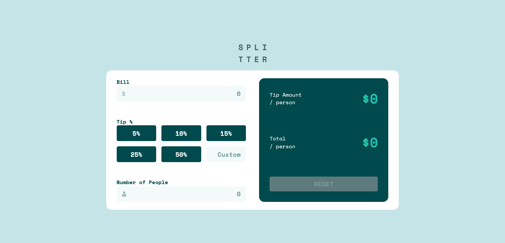

# Frontend Mentor - Tip calculator app solution

This is a solution to the [Tip calculator app challenge on Frontend Mentor](https://www.frontendmentor.io/challenges/tip-calculator-app-ugJNGbJUX). Frontend Mentor challenges help you improve your coding skills by building realistic projects.

## Overview

### The challenge

Users should be able to:

- View the optimal layout for the app depending on their device's screen size
- See hover states for all interactive elements on the page
- Calculate the correct tip and total cost of the bill per person

### Screenshot

### Links

- Solution URL: [https://www.frontendmentor.io/solutions/react-jsx-javascript-and-sass-fVf9lh6G2](https://www.frontendmentor.io/solutions/react-jsx-javascript-and-sass-fVf9lh6G2)
- Live Site URL: [https://shamwela-tip-calculator.netlify.app](https://shamwela-tip-calculator.netlify.app)

## My process

### Built with

- React (JSX, JavaScript)
- Sass (Grid, Flexbox, Mobile-first)

### What I learned

I had to use "tel" input instead of "number" because "number" doesn't fire onChange event if the input is wrong

### Continued development

I will learn more Sass features and TypeScript.

### Useful resources

- [w3schools' CSS Grid](https://www.w3schools.com/css/css_grid.asp) - This helped me with CSS Grid because I almost always forget the syntax.

## Author

- Website - [shamwela.com](https://shamwela.com)
- Frontend Mentor - [@shamwela](https://www.frontendmentor.io/profile/shamwela)
- Twitter - [@shamwela\_](https://twitter.com/shamwela_)
